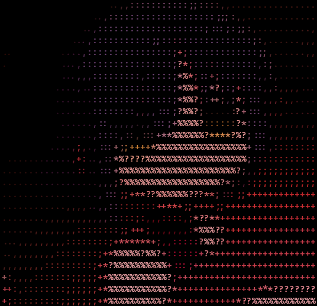

<p align="center">
    
</p>

<h1 align="center">wall-rs</h1>

<p align="center">Simple CLI tool to change your wallpapers randomly.</p>

<h2>Outline</h2>

- Fix the bug with detecting the pics folder.
- Create a mirror repository for storing pictures.
- Add a feature to change the wallpaper every X time.
- Rename the project.
- Add a feature to clone the mirror repository.

<h2>Known issues.</h2>

- Path manipulating is not very good and doesn't work in Windows.
- The code is not very well-written.
- Problems with cloning the mirror repository because of its huge size, currently it is [Anime-Girls-Holding-Programming-Books](https://github.com/cat-milk/Anime-Girls-Holding-Programming-Books)

<h2>Usage</h2>

> Linux-only now. <br>
> Also, it may work in MacOS but it is not tested yet.

Clone the repository(not published in crates.io yet):
```bash
git clone https://github.com/akumarujon/wall-rs
cd wall-rs
```

Run the code:
```bash
cargo run
```

<h2>License</h2>

This project is licensed under MIT. Check [LICENSE](./LICENSE)