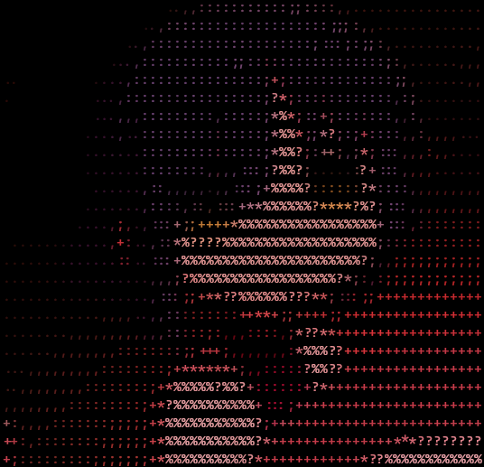

<p align="center">
    
</p>

<h1 align="center">wall-rs</h1>

<p align="center">Wallpaper manager for your desktop, written in Rust.</p>

## About

wall-rs is a wallpaper management tool that I developed with significant help from
the community. The initial idea for this project was suggested by my friend
<a href="https://github.com/tapnisu">tapnisu</a>. While I had the concept in
mind, <a href="https://github.com/orzklv">orzklv</a> played a crucial role in
bringing it to life by writing most of the first version during his
<a href="https://www.youtube.com/@orzklv/streams">live coding streams</a>. Moreover, he also
contributed a redesign of the project, further enhancing its functionality and
user experience. After these collaborative efforts, I took over the project,
rewriting some parts and fixing minor issues to refine the tool into its current
state. This project stands as a testament to the power of community-driven
development and the creative synergy that can emerge from live coding sessions
and ongoing collaboration.

## Installation

There are two ways to install wall-rs:

1. Using Cargo:

```bash
cargo install wall-rs
```

2. Building from source:

```bash
git clone https://github.com/akumarujon/wall-rs.git 
cd wall-rs 
cargo build --release
```

The executable will be available in `target/release/wall-rs.exe`

## Usage

To use wall-rs, run the executable with a command:

```bash
wall-rs <COMMAND>
```

## Commands

- `set`: Set a wallpaper to your desktop
- `random`: Set a random picture from assets as wallpaper
- `install`: Generate configurations and fetch assets
- `help`: Print the help message or the help of the given subcommand(s)

## Options

- `-h, --help`: Print help information

## Examples

1. Set a specific image as wallpaper:

```bash
wall-rs set path/to/image
```

2. Set a random image from a specific folder as wallpaper:

```bash
wall-rs random path/to/folder
```

<h2>License</h2>

This project is licensed under MIT. Check [LICENSE](./LICENSE)
